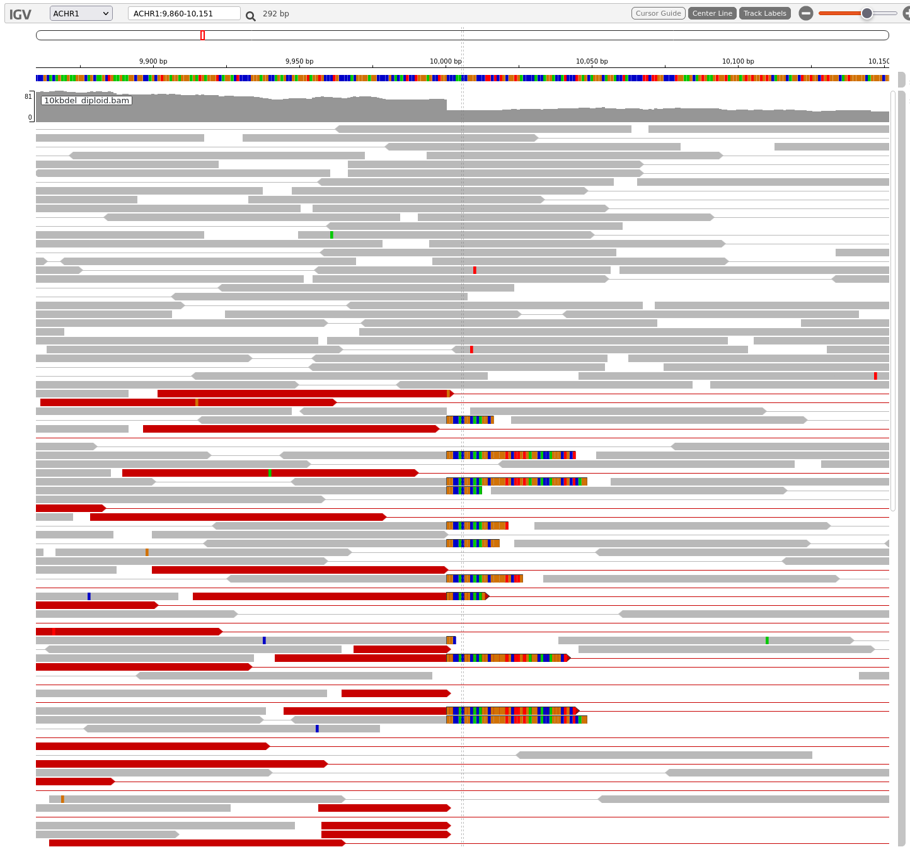
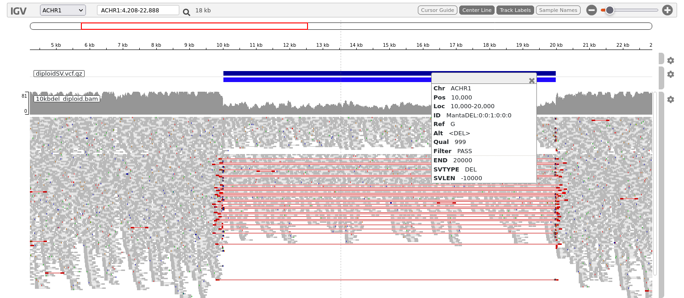
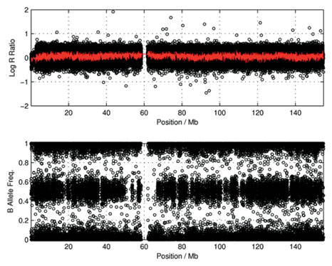
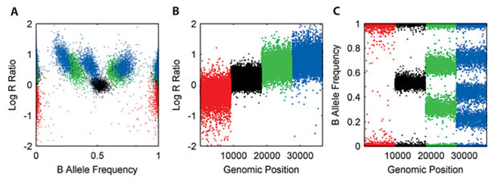
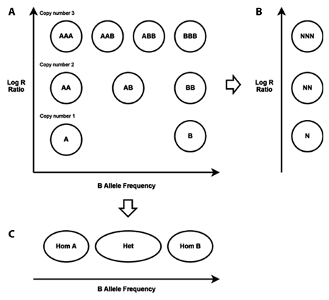
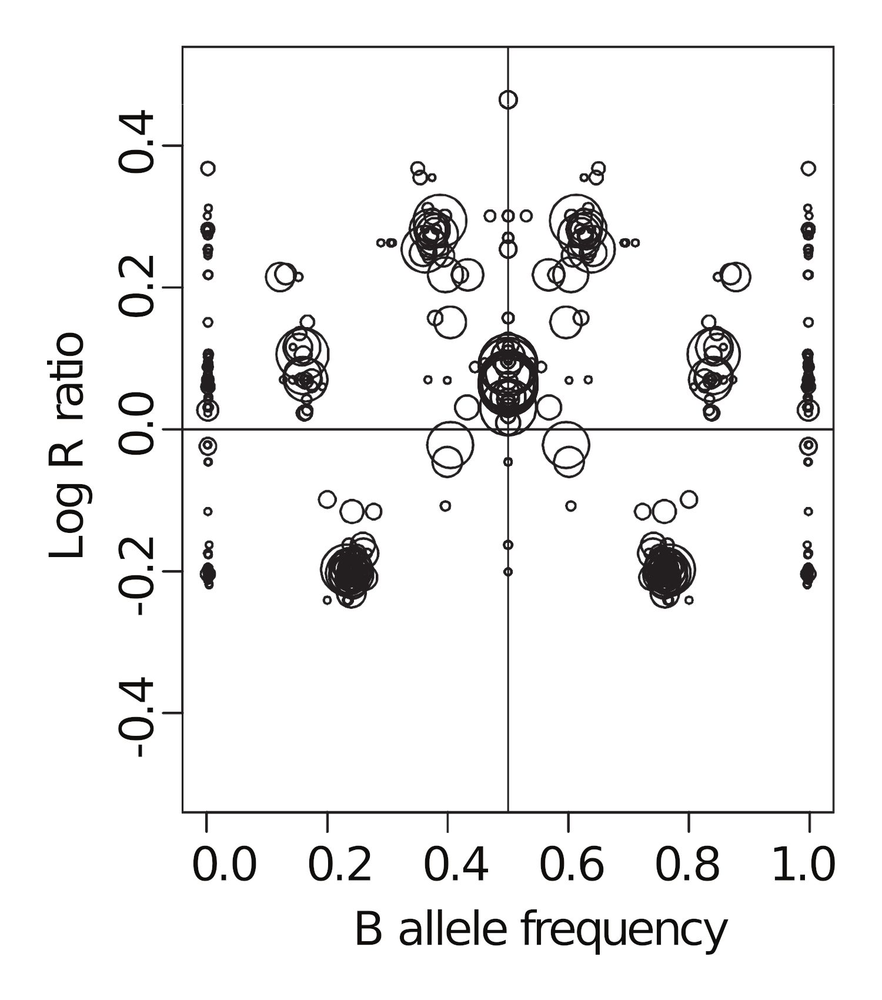

# Week 9 Practical Part 2: Structural variations

{:.no_toc}

* TOC
{:toc}


## 1. Setting up data for this class
---

Create a working directory for this class and prepare the data

```bash
# create working directory
mkdir -p ~/wk9_sv
# enter the directory
cd ~/wk9_sv
# copy the data file from ~/data
cp ~/data/structural_variation/* ./

```

You should now see these files in your working directory (`~/wk9_sv`):
```
.
|   ...(Data for Part 2)
├── 10kbdel_diploid.bam
├── 10kbdel_diploid.bam.bai
├── 10kb_duplication_diploid.bam
├── 10kb_duplication_diploid.bam.bai
├── 10kb_inversion_diploid.bam
├── 10kb_inversion_diploid.bam.bai
├── balanced_translocation.bam
├── balanced_translocation.bam.bai
├── compound_mono_allele.bam
├── compound_mono_allele.bam.bai
├── manta-1.6.0.centos6_x86_64.tar.bz2
├── mappable_region.fasta
├── mappable_region.fasta.fai
|
|   ...(Data for Part 3)
├── reference.fasta
├── reference.fasta.fai
├── sorted.bam
└── sorted.bam.bai

0 directories, 17 files
```


---

## 2. Examples of structural variations
---

The examples in this section are artificially generated read data for illustrating specific types of structural variations.

They are mapped to the reference file named `mappable_region.fasta`. 


### 2a. Visualising the data (SV: Deletion)

Download the FASTSA and bam files (and their index files) onto your workstation (via RStudio's file browser). Use stand-alone IGV or go to `https://igv.org/app/` on a browser.

(These instructions are for IGV web-app.)

Load `mappable_region.fasta` and corresponding index file under **Genome**, and load `10kbdel_diploid.bam` and index under **Tracks**. 

As the filename suggests, you should see a 10kb deletion.

1. Start from the 3' end, zoom in until you can start seeing aligned reads and coverage track.

2. Use these settings to help detect the 10kb deletion:
  * "Set track height": increase track height to 600 or higher (default is 300 pixels)
  * "Color by": select "pair orientation & insert size (TLEN)"
  * "Show soft clips"
  * "View as pairs"

You should be able to see the upstream breakpoint at 10,000bp.



Features that indicate the presence of a breakpoint and a deletion:

1. Sharp drop in the coverage track 

2. Presence of many soft-clipped reads at the same location (the breakpoint) and have the same sequence.

3. Highlighted (red) read pairs indicating fragments of unusually large size.

Now look for the other end of the deletion. You can do:

1. Keep scrolling left until you see a matching breakpoint.

2. Zoom out (you may need to increase "Visibility Window" in the Settings) until you can see the entire deletion.

3. Right-click on one of the highlighted fragments and select "View mate in split screen".


### 2b. SV detection using manta

You now have some idea how to spot a structural variant. However this can be quite tedious to do manually with large genome and many samples, so we are now going to use a SV caller to help us perform this process faster.

Manta (https://github.com/Illumina/manta) detects structural variations in paired-end NGS data by looking for breakpoints (split-reads), improper read-pairs, or inserts of usual sizes.

Manta works best with WGS data, because it relies in large part on being able to detect the breakpoints, which is often missed in captured data (such as WES and smaller panels). However, it is still able to detect SVs by read-pair orientations and insert sizes in those data.

A pre-compiled version of manta is provided in the data. First you need to uncompress the file:

```bash
$ tar xvf manta-1.6.0.centos6_x86_64.tar.bz2
```

This should have extracted into a directory called `manta-1.6.0.centos6_x86_64` with 4 sub-directories.

```
manta-1.6.0.centos6_x86_64/
├── bin
│   ├── configManta.py
│   ├── configManta.py.ini
│   └── runMantaWorkflowDemo.py
├── lib
├── libexec
└── share
```

Manta execution is a 2-step process, first you need to run `configManta.py`, which setups the manta pipeline in a specified output directory, and then you can execute the script generated.

Execute `configManta.py` with no arguments to see how to use the command:

```
$ ~/wk9_sv/manta-1.6.0.centos6_x86_64/bin/configManta.py

Usage: configManta.py [options]

Version: 1.6.0

This script configures the Manta SV analysis pipeline.
You must specify a BAM or CRAM file for at least one sample.

Configuration will produce a workflow run script which
can execute the workflow on a single node or through
sge and resume any interrupted execution.

Options:
  --version             show program's version number and exit
  -h, --help            show this help message and exit
  --config=FILE         provide a configuration file to override defaults in
                        global config file (/home/paul/Insync/gdrive/work_stuf
                        f/2022_UA_genomic_applications/final_dataset/class_set
                        /manta/bin/configManta.py.ini)
  --allHelp             show all extended/hidden options

(etc...)
```

First step is to execute `configManta.py`, which will generate manta workflow scripts. You may find it easier to use the executables if you add the manta `bin/` directory in your `PATH` variable. 


```bash

$ configManta.py \
  --bam 10kbdel_diploid.bam \
  --referenceFasta mappable_region.fasta \
  --runDir 10kb_del 

Successfully created workflow run script.
To execute the workflow, run the following script and set appropriate options:

~/wk9_sv/10kb_del/runWorkflow.py

```

This should then create a sub-directory, `10kb_del`, with the structure:

```
10kb_del/
├── results
│   ├── evidence
│   ├── stats
│   └── variants
├── runWorkflow.py
├── runWorkflow.py.config.pickle
└── workspace
```

Then execute the `runWorkflow.py` script within:

```
10kb_del/runWorkflow.py
```

If everything goes well you should see something like this at the end of the standard output:
```
[2022-05-11T01:36:39.577201Z] [bioinf-3010-2022-5] [218022_1] [WorkflowRunner] Manta workflow successfully completed.
[2022-05-11T01:36:39.577201Z] [bioinf-3010-2022-5] [218022_1] [WorkflowRunner]
[2022-05-11T01:36:39.577201Z] [bioinf-3010-2022-5] [218022_1] [WorkflowRunner]  workflow version: 1.6.0
[2022-05-11T01:36:39.577770Z] [bioinf-3010-2022-5] [218022_1] [WorkflowRunner]
[2022-05-11T01:36:39.578122Z] [bioinf-3010-2022-5] [218022_1] [WorkflowRunner] Workflow successfully completed all tasks
[2022-05-11T01:36:39.578464Z] [bioinf-3010-2022-5] [218022_1] [WorkflowRunner] Elapsed time for full workflow: 2 sec
```

Now, if you examine the directory `10kb_del/results` you should see something like:

```
.
├── results
│   ├── evidence
│   ├── stats
│   │   ├── alignmentStatsSummary.txt
│   │   ├── svCandidateGenerationStats.tsv
│   │   ├── svCandidateGenerationStats.xml
│   │   └── svLocusGraphStats.tsv
│   └── variants
│       ├── candidateSmallIndels.vcf.gz
│       ├── candidateSmallIndels.vcf.gz.tbi
│       ├── candidateSV.vcf.gz
│       ├── candidateSV.vcf.gz.tbi
│       ├── diploidSV.vcf.gz
│       └── diploidSV.vcf.gz.tbi
```

The most important file is the `diploidSV.vcf.gz` file, which contains the
SV calls made by the caller.

Download this file and its index (`diploidSV.vcf.gz.tbi`) and load them into IGV.

It may be easier for viewing if you drag this track to be on top of the aligned reads track.
You can do this by dragging the grey bar on the right side of the track.



Click on the darker blue bar on top. This provides the information about the location, size and type of the structural variant which has been identified by manta.


### 2c. Other types of SV

Repeat the above processes (visual examination and SV-calling using manta) with:

* `10kb_duplication_diploid.bam`

* `10kb_inversion_diploid.bam`

* `balanced_translocation.bam`

Familiarise yourself with these examples. You'll need to understand them to be able to solve the assignment questions.


---

## 3. SVs in Coriell sample NA12878

---

This is an optional exercise. Try it if you wish to test what you have learnt above on an actual biological sample.

The data for this part is sequenced from a Coriell sample (NA12878) from the Genome in a Bottle project, which provides well characterised samples that can be used for benchmarking tools. We are using a very small region of WGS data from this sample, just reads from a 200kb region on chr 3. The read data (`sorted.bam`) have been remapped to the truncated chr3 region (`reference.fasta`). 

**Exercises:**

* *Load the bam file and the reference file to IGV.*
* *How many SVs can you identify visually? Write down as many as you can see.*
* *Run manta on this data. Does the manta output match the results of your visual inspection?*


-----

## 4. Interpreting copy number variation data

-----

### 4a. Background

SNP array data can be used to detect CNV in samples. For each probe, we obtain
the intensities for the A and B alleles, X and Y. X/Y values of individual locus
can be quite noisy and not as useful. However, CNV can be inferred from two
derived values:

* B-allele frequency (BAF), provides the ratio between the two alleles at the locus

    BAF = Y / (X+Y)

* Log-R-Ratio (LRR), is the normalised log intensity, which represents a measurement
of the total copy number

    LRR = log(X+Y)


A diploid region exhibiting no large scale CNV would look like this:



(Yau and Holmes, Cytogenet Genome Res 123:307–312, 2008, doi:10.1159/000184722)

Note that as LRR is a log ratio, this means that the actual copy number does not scale linearly with LRR:

| copy number | ratio to diploid | LRR |
| ----- |  ----- | ----- |
| 5  | 2.5    | 0.92 |
| 4  | 2      | 0.69 |
| 3  | 1.5    | 0.41 |
| 2  | 1      | 0     |
| 1  | 0.5    | -0.69 |

This figure then shows what CNVs would look like for copy number = :

* 1 (red): A, B
* 2 (black): AA, AB, BB
* 3 (green): AAA, AAB, BBA, BBB
* 4 (blue): AAAA, AAAB, AABB, ABBB, BBBB



(Yau and Holmes, 2008)

However, in practice, you should typically not expect to see a mixture of multiple allele ratios for a given CN.
For example, if a region has CN=3, you should see either AAAB/ABBB or just AABB, but not both.

In other words, in the BAF plots, you should either see a single central heterozygous band (allele-balanced), or only two split bands equally distanced from 0.5. Three separate bands as shown in the figure above is unlikely to happen.

* *Under what circumstances might you expect to see more than 2 split bands in a BAF plot?*

Panel A in figure above is a useful way to display how many different clusters of CNVs exist in the sample.



(Yau and Holmes, 2008)


### 4b. Interpreting data

This is a set of published SNP array data (*), showing the B-allele frequency (BAF)
on the top panel, and the Log-R-Ratio (normalised light intensity).

(\*) *Popova et al. Genome Biol 10, R128 (2009)*


The thin bands at the top and bottom of the BAF panel at 0 and 1 are the homozygous
REF and ALT loci, respectively.

*Can you identify:*

* *any heterozygous diploid regions? i.e. regions that don't exhibit any CNV*

* *any LOH regions? both copy number change and copy-neutral types.*


The corresponding LRR-vs-BAF plot looks like this:



Using the earlier LRR-vs-BAF diagram for reference:

* *Can you label the major clusters?*

* *How and why does this figure look different from the previous diagram?*

* *Can you then use this figure to estimate the tumour purity?*
